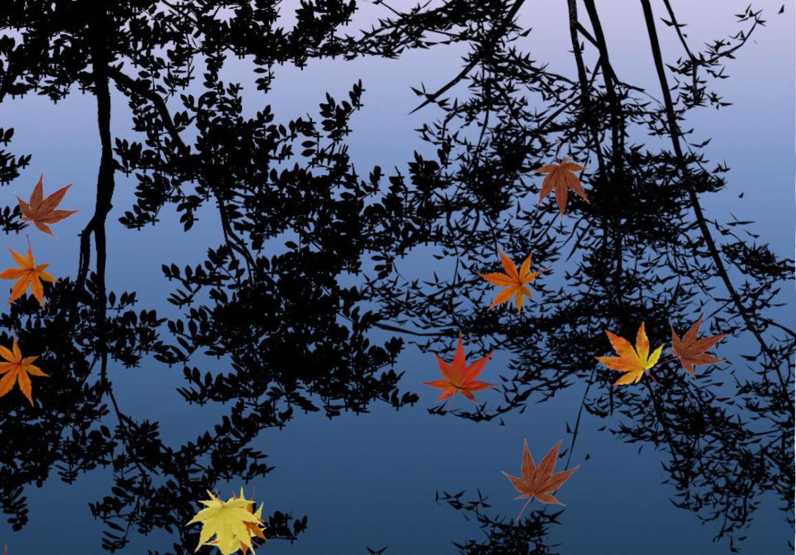

# Water (Autumn Leaves)

A desktop recreation of the classic Android **Water** live wallpaper from the 2009–2010 era. Autumn leaves drift across a reflective pond, with ripples responding to your touch.

Built with the original AOSP textures and ripple algorithm, adapted for Windows. The historical AOSP implementation is named `Fall` internally. This project is an independent recreation, not an official Samsung or Google release, and has not been matched frame by frame against a specific Galaxy firmware.



## Try it

**Wallpaper Engine:** [View on Steam Workshop](https://steamcommunity.com/sharedfiles/filedetails/?id=3815903983).

Now publicly available on Steam Workshop. Subscribe to install it through Wallpaper Engine.

Download the repository, then open `wallpaper/index.html` in a WebGL-capable browser. No dependencies, build step, server, or network connection are required.

- Click the water to make a ripple.
- Press **Space** to pause or resume.

For desktop use:

| Engine | Import |
| --- | --- |
| Sucrose | Build the Sucrose ZIP, drag it into the library, then choose **Use**. |
| Lively | Build the Lively ZIP and import it into the library. |
| Wallpaper Engine | Subscribe via [Steam Workshop](https://steamcommunity.com/sharedfiles/filedetails/?id=3815903983). To use the source locally, create a web wallpaper from `wallpaper/index.html` in the editor. |

The repository includes metadata for all three engines. Browser rendering, click input, and pause/resume have been checked. The maintainer uses Sucrose and has imported the project into Wallpaper Engine and uploaded it to Steam Workshop. Full compatibility testing across all three engines is still pending. Desktop input forwarding depends on the engine's settings and focus. Rendering is capped at approximately 33 FPS; a lower Wallpaper Engine FPS setting is respected. This setting belongs to each user and is not bundled with the wallpaper.

Download the **[1.0.1 stable release](https://github.com/Kandecho/Water-live-wallpaper/releases/tag/v1.0.1)** for ready-made Sucrose and Lively import packages. GitHub's automatic source ZIP is the whole repository, not an engine import package.

## Build import packages

On Windows with PowerShell 7:

```powershell
pwsh -NoProfile -File scripts/package.ps1
```

This writes `Water-Original-Sucrose-1.0.1.zip` and `Water-Original-Lively-1.0.1.zip` into `dist/`. Runtime files sit at the ZIP root. Generated packages are excluded from Git; attach them to a Release when ready.

## How it works

The scene uses 14 leaves, an eight-cell texture atlas, and up to ten analytic ripple sources. A sine wave describes each expanding ripple. Local mesh normals offset the pond texture coordinates; the leaves render separately. There is no fluid solver.

A fixed 30 ms update step preserves the original animation timing on modern monitors. Desktop adaptations include upright, aspect-preserving background cropping and a single viewport instead of Android launcher pages. Original bitmap resolution is retained.

## Project layout

```text
wallpaper/       Standalone runtime and engine metadata
reference/       Original AOSP images and two source files
docs/            Preview and archived research notes
tests/           Simulation checks
scripts/         Package creation
dist/            Local ZIP packages (not tracked)
```

`wallpaper/simulation.js` handles leaf motion and ripples; `wallpaper/renderer.js` handles WebGL and input. `wallpaper/assets.js` embeds the original image bytes as Base64 so the wallpaper also works through `file://`.

Run the existing checks with Node.js:

```sh
node tests/simulation.cjs
node --check wallpaper/renderer.js
node --check wallpaper/simulation.js
```

The simulation checks compare the analytic wave and triangle normals against independent formulas, exercise landing and drift, run ten simulated minutes, and check portrait through 32:9 grids. They do not replace visual or engine compatibility testing.

For the browser edge regression, serve the repository (for example, `python -m http.server 8000`), then open `http://localhost:8000/tests/edge-render.html`. It checks the rendered pond border at 16:9, portrait, and 32:9 with strong and weak waves. All three cases should report zero white edge pixels.

## Water HD — Preview 1

**[Download the HD preview](https://github.com/Kandecho/Water-live-wallpaper/releases/tag/hd-v0.1.0-preview.1)** — a separate pre-release, version `0.1.0-preview.1`.

An HD reinterpretation is available in [`wallpaper-hd/`](wallpaper-hd/). It combines the 4K pond with 512px reconstructions of the eight original leaf sprites, positional canopy shade, varied floating poses, wave-linked petiole menisci and click/drag ripples. The classic 1.0.1 release and Workshop project are unchanged.


Import `Water-HD-0.1.0-preview.1.zip` into Sucrose or Lively. For Wallpaper Engine, extract it and create a **new web wallpaper** from `index.html`. This HD preview has not replaced the classic Steam Workshop item. GitHub's automatic source ZIP is not the import package.

Open `wallpaper-hd/preview.html` for comparison controls, or `wallpaper-hd/index.html` for a clean wallpaper. **C** toggles lighting, **S** canopy shade, **B** leaf motion, **T** local menisci, **L** leaves, **Space** pause, and **H** the panel. Switches work while paused. Rendering targets up to 60 FPS and respects lower Wallpaper Engine limits.

All artwork and maps are prepared offline and embedded. No server, model, image processing or network is required at startup. Edit `wallpaper-hd/settings.js` to tune the look. See [HD architecture](docs/hd-architecture.md), [background provenance](docs/background-upscale.txt), and [leaf reconstruction](docs/leaf-upscale.txt).

```powershell
pwsh -NoProfile -File scripts/package-hd.ps1
```

This writes the HD ZIP and `Water-HD-SHA256SUMS.txt` to `dist/`. Checks cover analytic motion, contact fields, silhouette/petiole preservation, isolated shadows, reproducible maps, positional lighting, lifecycle hooks and 16:9 / portrait / ultrawide / 4K browser rendering. Native engine compatibility and sustained desktop performance still require target-system testing.

Next experiments are shared gentle gusts, followed by local leaf bending. Direct leaf-pushing interaction is not planned. The accepted preview stays available as a baseline.

## Sources and license

Based on [AOSP Basic live wallpapers](https://android.googlesource.com/platform/packages/wallpapers/Basic/+/74e84e6cbea39c5946d86d93460f753e03a90607/), pinned to commit `74e84e6cbea39c5946d86d93460f753e03a90607`.

Copyright (C) 2009 The Android Open Source Project. Desktop adaptation maintained by Kandecho. See [LICENSE.txt](LICENSE.txt) and [NOTICE.txt](NOTICE.txt) for attribution and changes.

Historical research pages in `docs/` describe the investigation at the time they were written. This README records the current project state.
