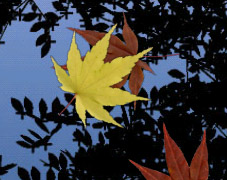
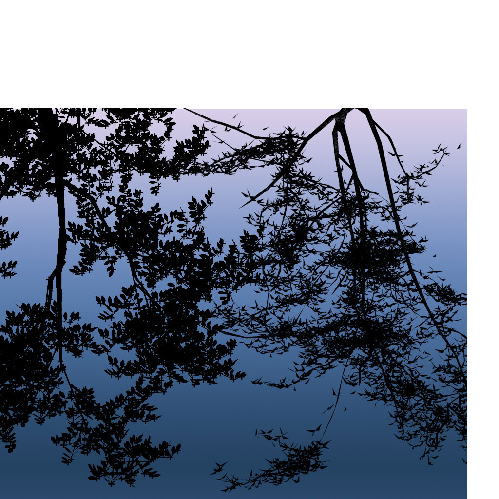

先看原始素材，再用现成演示感受整体氛围。最终目标是由 Windows 壁纸引擎运行交互式壁纸。

## A 原版自带的效果缩略图

这张小图来自原始资源包，并非新合成的效果图。
冷蓝色背景、黑色树影和暖色秋叶，是它的主要视觉特征。

## B 原始背景贴图

上方和右侧的白色区域属于贴图留白，不是壁纸画面。
源码通过纹理坐标选择约 960×800 的有效区域。
手机视口还会选取其中一部分，并随桌面切换移动。

在大屏上，树影轮廓仍然鲜明。我的视觉判断是：1080p 可以先保留这种柔和质感，4K 下会更明显地暴露细节不足。
这还不是实际桌面运行测试。

## C 原始叶子图集

每个单元约 128×128 像素。最终画面用透明混合绘制单片叶子。
先按合理尺寸使用这些原图，比直接放大叶子更容易保持原版观感。

## D 已有实现：可以直接打开的 WebGL 演示
[打开 Fall — Autumn Leaves 动态演示](https://dynnbw.github.io/RE-Android-Live-Wallpapers/fall/)

已在浏览器中确认画面可以显示。项目提供点击水面产生涟漪的交互。

它属于 Reborn Android Live Wallpapers 的网页演示。
当前脚本使用 20 种叶子图案，且修改了波纹衰减公式。
因此它是可参考的现代移植，不能当作未经修改的原版。

[项目源码](https://github.com/dynnbw/RE-Android-Live-Wallpapers) · [网页演示脚本](https://dynnbw.github.io/RE-Android-Live-Wallpapers/fall/fall.js)

## E Windows 桌面路线
| 方案 | 已确认 | 尚未确认 |
|---|---|---|
| 现成同款工坊成品 | 本轮未找到可靠匹配 | 不等于不存在 |
| Wallpaper Engine 网页壁纸 | 官方支持导入本地 HTML 项目 | 本项目尚未打包、上桌面测试 |
| Lively 网页壁纸 | 官方提供网页播放器及鼠标交互 | 本项目尚未打包、上桌面测试 |

建议保留本地 HTML、JavaScript 和原始图片，采用简单 WebGL 渲染。
桌面嵌入交给现有壁纸工具处理。
网页原型可以沿用到最终桌面版本。

[Wallpaper Engine 导入说明](https://docs.wallpaperengine.io/en/web/first/gettingstarted.html) · [Lively 网页播放器](https://github.com/lively-community/lively/wiki/Web-Player)

## F 素材来源
素材取自 AOSP Basic 的历史提交 74e84e6cbea39c5946d86d93460f753e03a90607。
下载后的三个图片文件保持原始字节，未重绘或重采样。

[原始素材目录](https://android.googlesource.com/platform/packages/wallpapers/Basic/+/74e84e6cbea39c5946d86d93460f753e03a90607/res/drawable-hdpi/)

本轮尚未核对具体 Galaxy 固件中的素材差异。
